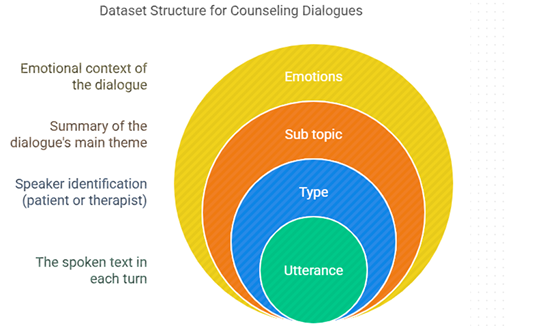
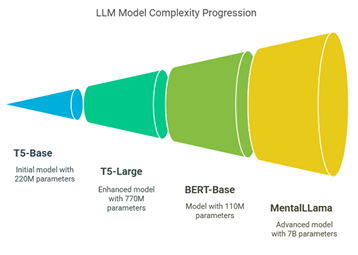
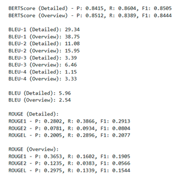

# 📘 Project Overview

Mental health counselling summarization

# Introduction
This project focuses on developing an automated system to summarize mental health counseling dialogues, helping clinicians by condensing lengthy therapy sessions into clear, actionable summaries. Leveraging sequence-to-sequence models like T5-base, T5-large, and instruction-aware LLM MentaLLaMA, along with domain-specific preprocessing (e.g., speaker tagging), we aim to capture the nuances of therapeutic conversations efficiently. Using Parameter-Efficient Fine-Tuning methods like QLoRA, the project balances clinical utility and computational feasibility. Initial results with T5-base are promising, with ongoing improvements expected from larger models and specialized techniques to better support mental health professionals in documentation and care.


1. **`preprocess.ipynb`** – Handles data loading and preprocessing tasks.
2. **`T5_Large.ipynb`** – Fine-tunes a T5-Large model on the processed data.

---

## 📁 File Descriptions

## Dataset Structure


## Dataset
[Link](https://drive.google.com/file/d/1CbichQBDeWvBCy6FxQpiXIHB-390wZIL/view?usp=sharing)

### Example
{
 "id": 123,
 "input_text": [
 "therapist: today ? heard . okay thanks asking .
 name ? patient: tom tom beckwith therapist
 : hands normally write ? right ? right hand
 would right ask questions memory .
 therapist: season year ? patient: winter
 therapist: date today ? therapist: day week
 ? patient: tuesday ? therapist: month ?
 patient: january therapist: tell country ?
 patient: united states . therapist: county
 ? patient: wilmington . therapist: city ?
 patient: wilmington . therapist: name
 building ? patient: graduate center .
 therapist: floor building ? patient: first
 floor therapist: going name three objects .
 set want repeat back . apple table penny
 patient: apple table penny therapist:
 remember . going ask name minutes . patient
 : world . therapist: spell backwards .
 patient: dlorw therapist: three objects
 asked remember ? patient: apple table penny
 therapist: called ? patient: watch
 therapist: called ? patient: pen .
 therapist: would like repeat phrase .
 phrase ifs ands buts . patient: ifs buts
 ants therapist: read words page . says .
 patient: close eyes . therapist: take paper
 right hand . fold paper hands put paper
 lap . patient: thank .",
 "therapist started session memory test consists
 questions date city floor etc . therapist
 asks patient repeat words . patient really
 well . therapist tell keep words mind
 therapist ask later . therapist asks count
 number backwards difficult patient .
 therapist asks repeat words asked earlier .
 therapist asks random questions asks
 repeat words asked earlier . therapist asks
 questions things around patient well ."
 ]
 }

### `preprocess.ipynb`

- Loads the dataset.
- Performs data cleaning (e.g., removing nulls, filtering text).
- Tokenizes or formats the data as needed.
- Saves the processed data for use in training.


### `T5_Large.ipynb`

- Loads the preprocessed dataset.
- Initializes and configures the T5-Large model using HuggingFace Transformers.
- Sets training parameters such as learning rate, batch size, and number of epochs.
- Trains the model and evaluates it on a validation/test set.
- Optionally saves the trained model.



## Results
The training process completed successfully in approximately
 4 minutes. Key metrics:
 • Epoch: 2.85
 • Total FLOPs: 754117 GF
 • Train Loss: 0.0 (due to early stopping)
 • Runtime: 3m 54s
 • Samples/sec: 1.68
 • Steps/sec: 0.205
 

 ## Saved Model
 [T5-Large](https://drive.google.com/file/d/1Ng7gzYs0lFV9jBOgx19CTPR89KPJYtmc/view?usp=sharing)
 [T5-Large-MultiView](https://drive.google.com/file/d/1vSsd-A5oeSUXaRgULOflhSia07OoDaAz/view?usp=sharing)
 [T5-Llama](https://drive.google.com/file/d/120AcjMxSVV4YfB2cYt4goVbG-fP-lOiW/view?usp=sharing)

## ⚙️ Requirements

Make sure you have the following libraries installed:

```bash
pip install transformers datasets scikit-learn pandas numpy torch tqdm
```

Also ensure you're using a compatible version of Python (3.7+ is recommended).

---

## 🚀 How to Run

1. **Preprocess the Data**  
   Run `preprocess.ipynb` to clean and prepare your dataset.

2. **Train the Model**  
   Run `T5_Large.ipynb` to fine-tune the T5 model using the preprocessed data.

---

## 📌 Notes

- It is recommended to run these notebooks in a GPU-enabled environment for faster training.
- Preprocessed data should be saved in a format that `T5_Large.ipynb` can read (like CSV or JSON).
- You may customize the model name, max token lengths, or training parameters within the notebook.
